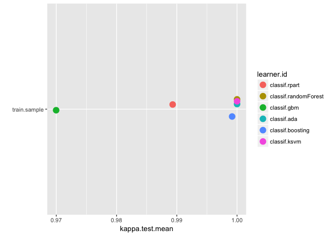
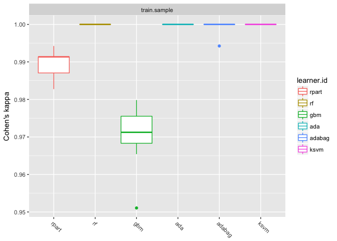
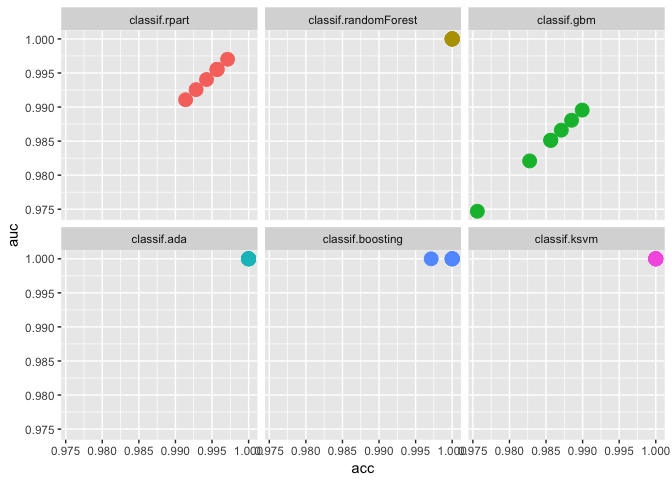
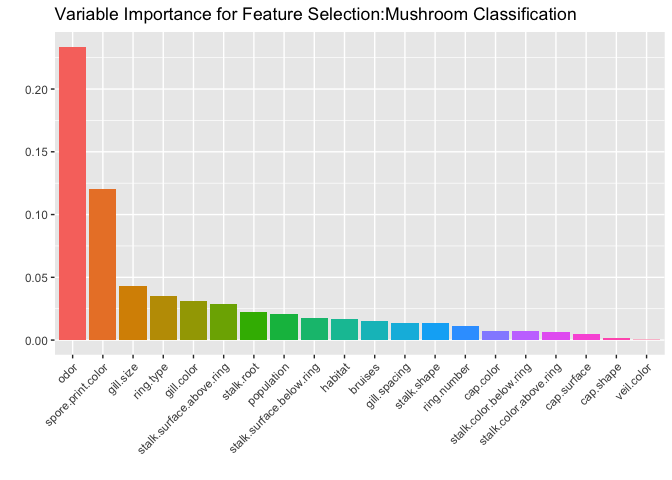

Mushroom classification
================
Aankur Bhatia
2017-01-09

First get the data

``` r
mushroom=read.csv("mushrooms.csv")
str(mushroom)
```

    ## 'data.frame':    8124 obs. of  23 variables:
    ##  $ class                   : Factor w/ 2 levels "e","p": 2 1 1 2 1 1 1 1 2 1 ...
    ##  $ cap.shape               : Factor w/ 6 levels "b","c","f","k",..: 6 6 1 6 6 6 1 1 6 1 ...
    ##  $ cap.surface             : Factor w/ 4 levels "f","g","s","y": 3 3 3 4 3 4 3 4 4 3 ...
    ##  $ cap.color               : Factor w/ 10 levels "b","c","e","g",..: 5 10 9 9 4 10 9 9 9 10 ...
    ##  $ bruises                 : Factor w/ 2 levels "f","t": 2 2 2 2 1 2 2 2 2 2 ...
    ##  $ odor                    : Factor w/ 9 levels "a","c","f","l",..: 7 1 4 7 6 1 1 4 7 1 ...
    ##  $ gill.attachment         : Factor w/ 2 levels "a","f": 2 2 2 2 2 2 2 2 2 2 ...
    ##  $ gill.spacing            : Factor w/ 2 levels "c","w": 1 1 1 1 2 1 1 1 1 1 ...
    ##  $ gill.size               : Factor w/ 2 levels "b","n": 2 1 1 2 1 1 1 1 2 1 ...
    ##  $ gill.color              : Factor w/ 12 levels "b","e","g","h",..: 5 5 6 6 5 6 3 6 8 3 ...
    ##  $ stalk.shape             : Factor w/ 2 levels "e","t": 1 1 1 1 2 1 1 1 1 1 ...
    ##  $ stalk.root              : Factor w/ 5 levels "?","b","c","e",..: 4 3 3 4 4 3 3 3 4 3 ...
    ##  $ stalk.surface.above.ring: Factor w/ 4 levels "f","k","s","y": 3 3 3 3 3 3 3 3 3 3 ...
    ##  $ stalk.surface.below.ring: Factor w/ 4 levels "f","k","s","y": 3 3 3 3 3 3 3 3 3 3 ...
    ##  $ stalk.color.above.ring  : Factor w/ 9 levels "b","c","e","g",..: 8 8 8 8 8 8 8 8 8 8 ...
    ##  $ stalk.color.below.ring  : Factor w/ 9 levels "b","c","e","g",..: 8 8 8 8 8 8 8 8 8 8 ...
    ##  $ veil.type               : Factor w/ 1 level "p": 1 1 1 1 1 1 1 1 1 1 ...
    ##  $ veil.color              : Factor w/ 4 levels "n","o","w","y": 3 3 3 3 3 3 3 3 3 3 ...
    ##  $ ring.number             : Factor w/ 3 levels "n","o","t": 2 2 2 2 2 2 2 2 2 2 ...
    ##  $ ring.type               : Factor w/ 5 levels "e","f","l","n",..: 5 5 5 5 1 5 5 5 5 5 ...
    ##  $ spore.print.color       : Factor w/ 9 levels "b","h","k","n",..: 3 4 4 3 4 3 3 4 3 3 ...
    ##  $ population              : Factor w/ 6 levels "a","c","n","s",..: 4 3 3 4 1 3 3 4 5 4 ...
    ##  $ habitat                 : Factor w/ 7 levels "d","g","l","m",..: 6 2 4 6 2 2 4 4 2 4 ...

``` r
table(mushroom$class)
```

    ## 
    ##    e    p 
    ## 4208 3916

Load required libraries

``` r
library(mlr)
```

    ## Loading required package: ParamHelpers

``` r
library(dplyr)
```

    ## 
    ## Attaching package: 'dplyr'

    ## The following objects are masked from 'package:stats':
    ## 
    ##     filter, lag

    ## The following objects are masked from 'package:base':
    ## 
    ##     intersect, setdiff, setequal, union

``` r
library(ggplot2)
library(formattable)
```

Remove features that have limited variance using the function removeConstantFeatures

``` r
mushroom=removeConstantFeatures(mushroom)
```

    ## Removing 1 columns: veil.type

Removed one feature veil.type from the feature set

Now, splitting the data into training and test set - 60%-40%

``` r
sampleID=sample(nrow(mushroom),0.6*nrow(mushroom),replace = FALSE)
train.sample=mushroom[sampleID,]
test.sample=mushroom[setdiff(1:nrow(mushroom),sampleID),]
```

Create a benchmark experiment to find the best model for classification, first create a training task

``` r
mushroom.trn.task=makeClassifTask(data = train.sample,target = "class")
mushroom.trn.task
```

    ## Supervised task: train.sample
    ## Type: classif
    ## Target: class
    ## Observations: 4874
    ## Features:
    ## numerics  factors  ordered 
    ##        0       21        0 
    ## Missings: FALSE
    ## Has weights: FALSE
    ## Has blocking: FALSE
    ## Classes: 2
    ##    e    p 
    ## 2525 2349 
    ## Positive class: e

Now identify all learners that can perform classification for this task

``` r
alllearn=listLearners(mushroom.trn.task,warn.missing.packages = FALSE)[c("class","package")]
formattable(alllearn,align="l")
```

<table class="table table-condensed">
<thead>
<tr>
<th style="text-align:left;">
class
</th>
<th style="text-align:left;">
package
</th>
</tr>
</thead>
<tbody>
<tr>
<td style="text-align:left;">
classif.ada
</td>
<td style="text-align:left;">
ada
</td>
</tr>
<tr>
<td style="text-align:left;">
classif.avNNet
</td>
<td style="text-align:left;">
nnet
</td>
</tr>
<tr>
<td style="text-align:left;">
classif.binomial
</td>
<td style="text-align:left;">
stats
</td>
</tr>
<tr>
<td style="text-align:left;">
classif.boosting
</td>
<td style="text-align:left;">
adabag,rpart
</td>
</tr>
<tr>
<td style="text-align:left;">
classif.C50
</td>
<td style="text-align:left;">
C50
</td>
</tr>
<tr>
<td style="text-align:left;">
classif.cvglmnet
</td>
<td style="text-align:left;">
glmnet
</td>
</tr>
<tr>
<td style="text-align:left;">
classif.gausspr
</td>
<td style="text-align:left;">
kernlab
</td>
</tr>
<tr>
<td style="text-align:left;">
classif.gbm
</td>
<td style="text-align:left;">
gbm
</td>
</tr>
<tr>
<td style="text-align:left;">
classif.glmnet
</td>
<td style="text-align:left;">
glmnet
</td>
</tr>
<tr>
<td style="text-align:left;">
classif.h2o.deeplearning
</td>
<td style="text-align:left;">
h2o
</td>
</tr>
<tr>
<td style="text-align:left;">
classif.h2o.gbm
</td>
<td style="text-align:left;">
h2o
</td>
</tr>
<tr>
<td style="text-align:left;">
classif.h2o.glm
</td>
<td style="text-align:left;">
h2o
</td>
</tr>
<tr>
<td style="text-align:left;">
classif.h2o.randomForest
</td>
<td style="text-align:left;">
h2o
</td>
</tr>
<tr>
<td style="text-align:left;">
classif.IBk
</td>
<td style="text-align:left;">
RWeka
</td>
</tr>
<tr>
<td style="text-align:left;">
classif.J48
</td>
<td style="text-align:left;">
RWeka
</td>
</tr>
<tr>
<td style="text-align:left;">
classif.JRip
</td>
<td style="text-align:left;">
RWeka
</td>
</tr>
<tr>
<td style="text-align:left;">
classif.ksvm
</td>
<td style="text-align:left;">
kernlab
</td>
</tr>
<tr>
<td style="text-align:left;">
classif.lda
</td>
<td style="text-align:left;">
MASS
</td>
</tr>
<tr>
<td style="text-align:left;">
classif.logreg
</td>
<td style="text-align:left;">
stats
</td>
</tr>
<tr>
<td style="text-align:left;">
classif.lssvm
</td>
<td style="text-align:left;">
kernlab
</td>
</tr>
<tr>
<td style="text-align:left;">
classif.multinom
</td>
<td style="text-align:left;">
nnet
</td>
</tr>
<tr>
<td style="text-align:left;">
classif.naiveBayes
</td>
<td style="text-align:left;">
e1071
</td>
</tr>
<tr>
<td style="text-align:left;">
classif.nnet
</td>
<td style="text-align:left;">
nnet
</td>
</tr>
<tr>
<td style="text-align:left;">
classif.OneR
</td>
<td style="text-align:left;">
RWeka
</td>
</tr>
<tr>
<td style="text-align:left;">
classif.PART
</td>
<td style="text-align:left;">
RWeka
</td>
</tr>
<tr>
<td style="text-align:left;">
classif.probit
</td>
<td style="text-align:left;">
stats
</td>
</tr>
<tr>
<td style="text-align:left;">
classif.qda
</td>
<td style="text-align:left;">
MASS
</td>
</tr>
<tr>
<td style="text-align:left;">
classif.randomForest
</td>
<td style="text-align:left;">
randomForest
</td>
</tr>
<tr>
<td style="text-align:left;">
classif.randomForestSRC
</td>
<td style="text-align:left;">
randomForestSRC
</td>
</tr>
<tr>
<td style="text-align:left;">
classif.rpart
</td>
<td style="text-align:left;">
rpart
</td>
</tr>
<tr>
<td style="text-align:left;">
classif.svm
</td>
<td style="text-align:left;">
e1071
</td>
</tr>
<tr>
<td style="text-align:left;">
classif.xgboost
</td>
<td style="text-align:left;">
xgboost
</td>
</tr>
</tbody>
</table>
Select the learners for benchmarking

``` r
bench.learners=list(makeLearner("classif.rpart",predict.type = "prob"),makeLearner("classif.randomForest",predict.type = "prob"),makeLearner("classif.gbm",predict.type = "prob"),
                    makeLearner("classif.ada",predict.type = "prob"),
                  
                    makeLearner("classif.boosting",predict.type = "prob"),
                    makeLearner("classif.ksvm",predict.type = "prob"))
bench.learners
```

    ## [[1]]
    ## Learner classif.rpart from package rpart
    ## Type: classif
    ## Name: Decision Tree; Short name: rpart
    ## Class: classif.rpart
    ## Properties: twoclass,multiclass,missings,numerics,factors,ordered,prob,weights,featimp
    ## Predict-Type: prob
    ## Hyperparameters: xval=0
    ## 
    ## 
    ## [[2]]
    ## Learner classif.randomForest from package randomForest
    ## Type: classif
    ## Name: Random Forest; Short name: rf
    ## Class: classif.randomForest
    ## Properties: twoclass,multiclass,numerics,factors,ordered,prob,class.weights,featimp
    ## Predict-Type: prob
    ## Hyperparameters: 
    ## 
    ## 
    ## [[3]]
    ## Learner classif.gbm from package gbm
    ## Type: classif
    ## Name: Gradient Boosting Machine; Short name: gbm
    ## Class: classif.gbm
    ## Properties: twoclass,multiclass,missings,numerics,factors,prob,weights,featimp
    ## Predict-Type: prob
    ## Hyperparameters: keep.data=FALSE
    ## 
    ## 
    ## [[4]]
    ## Learner classif.ada from package ada
    ## Type: classif
    ## Name: ada Boosting; Short name: ada
    ## Class: classif.ada
    ## Properties: twoclass,numerics,factors,prob
    ## Predict-Type: prob
    ## Hyperparameters: xval=0
    ## 
    ## 
    ## [[5]]
    ## Learner classif.boosting from package adabag,rpart
    ## Type: classif
    ## Name: Adabag Boosting; Short name: adabag
    ## Class: classif.boosting
    ## Properties: twoclass,multiclass,missings,numerics,factors,prob,featimp
    ## Predict-Type: prob
    ## Hyperparameters: xval=0
    ## 
    ## 
    ## [[6]]
    ## Learner classif.ksvm from package kernlab
    ## Type: classif
    ## Name: Support Vector Machines; Short name: ksvm
    ## Class: classif.ksvm
    ## Properties: twoclass,multiclass,numerics,factors,prob,class.weights
    ## Predict-Type: prob
    ## Hyperparameters: fit=FALSE

Now, select the benchmarking resampling strategy

``` r
bench.resamp=makeResampleDesc(method = "CV",iters=7,stratify = TRUE)
bench.resamp
```

    ## Resample description: cross-validation with 7 iterations.
    ## Predict: test
    ## Stratification: TRUE

Finally, decide on the performance (evaluation) measures

``` r
listMeasures(mushroom.trn.task)
```

    ##  [1] "kappa"            "multiclass.brier" "fn"              
    ##  [4] "fp"               "multiclass.aunp"  "brier.scaled"    
    ##  [7] "multiclass.aunu"  "bac"              "qsr"             
    ## [10] "brier"            "tnr"              "fdr"             
    ## [13] "gmean"            "auc"              "tpr"             
    ## [16] "ber"              "logloss"          "ppv"             
    ## [19] "wkappa"           "mcc"              "timeboth"        
    ## [22] "timepredict"      "acc"              "lsr"             
    ## [25] "featperc"         "multiclass.au1p"  "multiclass.au1u" 
    ## [28] "gpr"              "tn"               "tp"              
    ## [31] "ssr"              "fnr"              "f1"              
    ## [34] "npv"              "fpr"              "timetrain"       
    ## [37] "mmce"

``` r
bench.measures=list(kappa,acc,auc,tpr,fpr)
```

Now, let's perform the benchmarking experiment

``` r
bench.expt=benchmark(learners = bench.learners,resamplings = bench.resamp,tasks = mushroom.trn.task,measures = bench.measures)
```

    ## Distribution not specified, assuming bernoulli ...
    ## Distribution not specified, assuming bernoulli ...
    ## Distribution not specified, assuming bernoulli ...
    ## Distribution not specified, assuming bernoulli ...
    ## Distribution not specified, assuming bernoulli ...
    ## Distribution not specified, assuming bernoulli ...
    ## Distribution not specified, assuming bernoulli ...

``` r
bench.expt
```

    ##        task.id           learner.id kappa.test.mean acc.test.mean
    ## 1 train.sample        classif.rpart       0.9893149     0.9946666
    ## 2 train.sample classif.randomForest       1.0000000     1.0000000
    ## 3 train.sample          classif.gbm       0.9699750     0.9850247
    ## 4 train.sample          classif.ada       1.0000000     1.0000000
    ## 5 train.sample     classif.boosting       0.9991789     0.9995901
    ## 6 train.sample         classif.ksvm       1.0000000     1.0000000
    ##   auc.test.mean tpr.test.mean fpr.test.mean
    ## 1     0.9944677             1  0.0110645751
    ## 2     1.0000000             1  0.0000000000
    ## 3     0.9844642             1  0.0310716824
    ## 4     1.0000000             1  0.0000000000
    ## 5     1.0000000             1  0.0008503401
    ## 6     1.0000000             1  0.0000000000

As it is evident, random Forest, ada, boosting and ksvm give perfect accuracy and auc

Let us now visualize the results

``` r
plotdata=getBMRPerformances(bench.expt,as.df = TRUE)
plotBMRSummary(bench.expt)
```



``` r
plotBMRBoxplots(bench.expt)+aes(color=learner.id)
```



``` r
ggplot(plotdata,aes(acc,auc,color=learner.id))+geom_point(aes(size=2))+facet_wrap(~learner.id)+theme(legend.position = "none")
```



Now, let us perform model training using ksvm learner which has perfect accuracy

``` r
model.learner=makeLearner("classif.ksvm",predict.type = "prob")
model.train=mlr::train(learner = model.learner,task = mushroom.trn.task)
model.predict=predict(model.train,newdata = test.sample)
model.predict
```

    ## Prediction: 3250 observations
    ## predict.type: prob
    ## threshold: e=0.50,p=0.50
    ## time: 0.84
    ##    truth       prob.e       prob.p response
    ## 3      e 0.9993889106 0.0006110894        e
    ## 4      p 0.0003710502 0.9996289498        p
    ## 6      e 0.9993851687 0.0006148313        e
    ## 15     e 0.9998959113 0.0001040887        e
    ## 16     e 0.9993068288 0.0006931712        e
    ## 18     p 0.0003840153 0.9996159847        p
    ## ... (3250 rows, 4 cols)

Let's see the performance of the model using caret package

``` r
library(caret)
```

    ## Loading required package: lattice

    ## 
    ## Attaching package: 'caret'

    ## The following object is masked from 'package:mlr':
    ## 
    ##     train

``` r
confusionMatrix(model.predict$data$truth,model.predict$data$response)
```

    ## Confusion Matrix and Statistics
    ## 
    ##           Reference
    ## Prediction    e    p
    ##          e 1683    0
    ##          p    0 1567
    ##                                      
    ##                Accuracy : 1          
    ##                  95% CI : (0.9989, 1)
    ##     No Information Rate : 0.5178     
    ##     P-Value [Acc > NIR] : < 2.2e-16  
    ##                                      
    ##                   Kappa : 1          
    ##  Mcnemar's Test P-Value : NA         
    ##                                      
    ##             Sensitivity : 1.0000     
    ##             Specificity : 1.0000     
    ##          Pos Pred Value : 1.0000     
    ##          Neg Pred Value : 1.0000     
    ##              Prevalence : 0.5178     
    ##          Detection Rate : 0.5178     
    ##    Detection Prevalence : 0.5178     
    ##       Balanced Accuracy : 1.0000     
    ##                                      
    ##        'Positive' Class : e          
    ## 

That's a perfect model with 100% correct prediction. Now let's try and find the variable importance

``` r
varimp=generateFilterValuesData(task = mushroom.trn.task)
varimp
```

    ## FilterValues:
    ## Task: train.sample
    ##              name   type randomForestSRC.rfsrc
    ## 1       cap.shape factor          1.579360e-03
    ## 2     cap.surface factor          5.137883e-03
    ## 3       cap.color factor          7.615547e-03
    ## 4         bruises factor          1.538785e-02
    ## 5            odor factor          2.338627e-01
    ## 6 gill.attachment factor          5.482249e-05
    ## ... (21 rows, 3 cols)

Plot Variable Importance

``` r
plotFilterValues(fvalues = varimp)+ggtitle("Variable Importance for Feature Selection:Mushroom Classification")+
  aes(fill=name)+theme(legend.position = "none")
```


